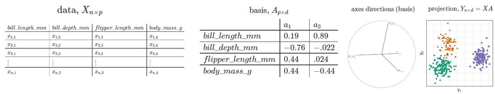
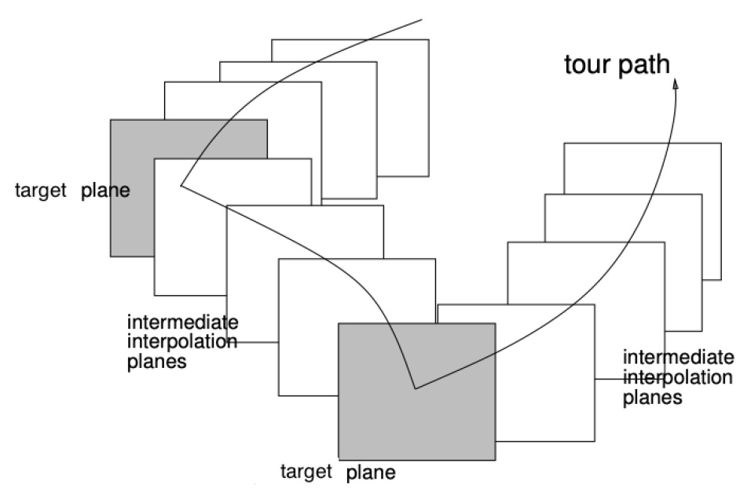
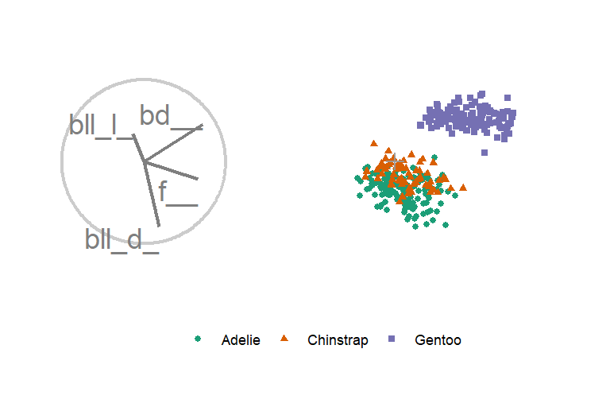
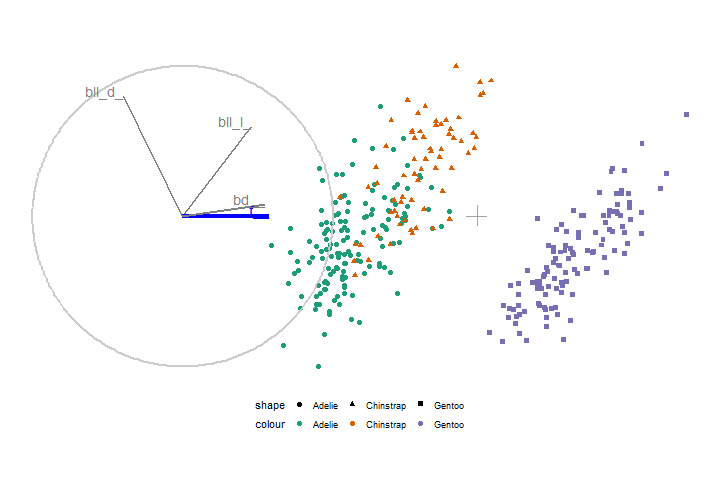
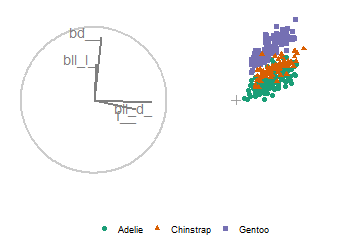
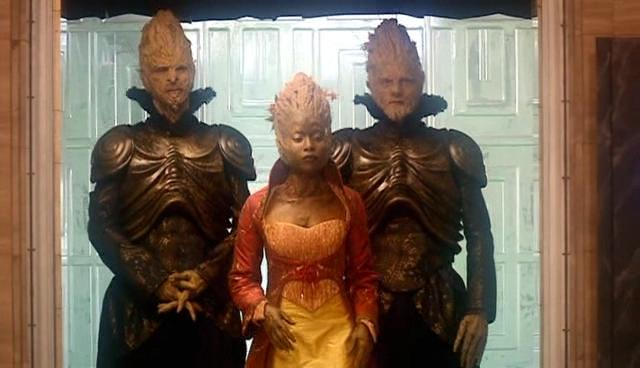

```{r, include=FALSE}
current_file <- knitr::current_input()
basename <- gsub(".Rmd$", "", current_file)

knitr::opts_chunk$set(
  fig.path = sprintf("images/%s/", basename),
  fig.width = 6,
  fig.height = 4,
  fig.align = "center",
  out.width = "100%",
  fig.retina = 3)
```

```{r, setup, include=FALSE}
knitr::opts_chunk$set(
  eval      = TRUE,   # R code
  echo      = FALSE,  # code text
  include   = TRUE,   # plots
  results   = 'asis', # text 'markup' 'asis' 'hold' 'hide'
  fig.align = "center",
  collapse  = TRUE,
  message   = F, warning = F, error = F,
  cache     = F, cache.lazy = F
)
require("knitr")
require("kableExtra")
require("magrittr")
## for cheem stuff:
require("plotly")
require("spinifex")
require("tourr")
require("cheem")
load("./R/2preprocess_simulation.RData")
shap_obs <- 18L; comp_obs <- 111L;

## prep linked plotly for later ----
THIS_linked_plotly_func <- function(
  layer_ls,
  shap_obs = NULL,
  comp_obs = NULL,
  height_px = 640L,
  width_px = 640L,
  do_include_maha_qq = FALSE
){
  .alpha <- ifelse(nrow(layer_ls$decode_df) > 999L, .1, .6)
  .xlab <- ifelse(do_include_maha_qq == FALSE, "PC1",
                  "PC1 | Quantile, chi-squared")
  .ylab <- ifelse(do_include_maha_qq == FALSE, "PC2",
                  "PC2 | Quantile, observed Mahalanobis distance")
  ## Remove QQ maha rows if needed
  plot_df <- layer_ls$plot_df ## Init
  if(do_include_maha_qq == FALSE){
    plot_df <- layer_ls$plot_df[
      layer_ls$plot_df$projection_nm != "QQ Mahalanobis distance", ]
    height_px <- height_px / 2L ## Half height display as qq maha is removed.
  }
  is_classification <- attr(layer_ls, "problem_type") == "classification"
  # ifelse("is_misclassified" %in colnames(layer_ls$decode_df), TRUE, FALSE)
  pred_clas <- as.factor(FALSE) ## If regression; dummy pred_clas
  if(is_classification == TRUE) pred_clas <-
    layer_ls$decode_df$predicted_class %>%
    rep_len(nrow(plot_df)) %>%
    as.factor()
  
  gg <- plot_df %>%
    plotly::highlight_key(~rownum) %>%
    ggplot(aes(V1, V2))
  ## Red misclassified points, if present
  if(is_classification == TRUE){
    .rn_misclass <- which(layer_ls$decode_df$is_misclassified == TRUE)
    .idx_misclas <- plot_df$rownum %in% .rn_misclass
    if(sum(.idx_misclas) > 0L){
      .df <- plot_df[.idx_misclas, ] %>% plotly::highlight_key(~rownum)
      gg <- gg +
        geom_point(aes(V1, V2), .df,
                   color = "red", fill = NA,
                   shape = 21L, size = 3L, alpha = .alpha)
    }
  }
  ## Highlight comparison obs, if passed
  if(is.null(comp_obs) == FALSE){
    .idx_comp <- plot_df$rownum == comp_obs
    if(sum(.idx_comp) > 0L){
      .df <- plot_df[.idx_comp, ] %>% plotly::highlight_key(~rownum)
      gg <- gg +
        ## Highlight comparison obs
        geom_point(aes(V1, V2, color = pred_clas[.idx_comp]),
                   .df, size = 4L, shape = 4L)
    }
  }
  ## Highlight shap obs, if passed
  if(is.null(shap_obs) == FALSE){
    .idx_shap <- plot_df$rownum == shap_obs
    if(sum(.idx_shap) > 0L){
      .df <- plot_df[.idx_shap, ] %>% plotly::highlight_key(~rownum)
      gg <- gg +
        geom_point(aes(V1, V2, color = pred_clas[.idx_shap]),
                   .df, size = 5L, shape = 8L)
    }
  }
  ## Maha skew text,
  #### geom_text not working with plotly... & annotate() not working with facets...
  if(do_include_maha_qq == TRUE){
    gg <- gg +
      geom_text(aes(x = -Inf, y = Inf, label = ggtext),
                hjust = 0L, vjust = 1L, size = 4L)
  }
  ## Normal points
  gg <- gg +
    suppressWarnings(geom_point(
      aes(V1, V2, color = pred_clas, shape = pred_clas, tooltip = tooltip),
      alpha = .alpha, show_legend = FALSE)) +
    facet_grid(rows = vars(projection_nm), cols = vars(layer_nm), scales = "free") +
    theme_bw() +
    labs(x = .xlab, y = .ylab) +
    scale_color_brewer(palette = "Dark2") +
    theme(axis.text  = element_blank(),
          axis.ticks = element_blank(),
          legend.position = "off")
  return(gg)
}
linked_plotly <- THIS_linked_plotly_func(
  layer_ls, shap_obs, comp_obs,
  do_include_maha_qq = FALSE) + ggplot2::theme(aspect.ratio = 1)
# %>%
#   ggplotly(tooltip = "tooltip") %>% #, width = 960, height = 480) %>%
#   config(displayModeBar = FALSE) %>% ## Remove html buttons
#   layout(dragmode = "select", showlegend = FALSE) %>% 
#   event_register("plotly_selected") %>%
#   highlight(on = "plotly_selected", off = "plotly_deselect")

  ## Prep rt_anim for later -----
.df <- layer_ls$shap_df
bas <- .df[shap_obs, -ncol(.df)] %>%
  as.matrix(nrow = 1L) %>% t() %>%
  tourr::normalise()
mv <- 2L#spinifex::manip_var_of(bas)
.opts <- rownames(bas)
mv_nm <- .opts[mv]

ggt142 <- radial_cheem_ggtour(
  layer_ls, bas, mv_nm,
  shap_obs, comp_obs,
  do_add_pcp_segments = TRUE,
  pcp_shape = c(142, 124), ## '|' plotly and gganimate respectively
  angle = .08)

rt_anim <- animate_plotly(ggt142) %>%
  layout(dragmode = FALSE, showlegend = FALSE) %>%
  ## Set drag left mouse
  event_register("plotly_selected") %>%
  ## Reflect "selected", on release of the mouse button.
  highlight(on = "plotly_selected", off = "plotly_deselect")
```

background-size: cover
class: title-slide
count: false

# .monash-blue[`r rmarkdown::metadata$title`]
<br>
<h2 style="font-weight:900!important;">`r rmarkdown::metadata$subtitle`</h2>
.bottom_abs.width100[
<br>
Presenter: *`r rmarkdown::metadata$author`* <br>
`r rmarkdown::metadata$affiliation` <br>
`r rmarkdown::metadata$email` <br>
`r rmarkdown::metadata$date` <br><br>
Slides -- `r rmarkdown::metadata$slides`
[nspyrison.github.io/mi2_talk](https://nspyrison.github.io/mi2_talk/#1)
]

---

# Terminology

Background in statistics using R

- *Variable* over attribute, column, measure
- *Observation* over item
- *Projection* over embedding
- R, Grammar of Graphics, & {ggplot2}


<br>
# Etiquette

- Please unmute & interrupt for clarifications & discussion
- Tangential or extension questions at the end, time permitting

---

# Outline

<br>
Three sections:

- Multivariate data visualization
- Linear projections & _tours_
- Local explanation of a black-box models & application of radial tours to local explanations, {cheem}

---
class: transition

## Multivariate data visualization

---

# Motivation

- Data visualization is better than numerical summarization alone
    - What would this 2D scatterplot look like?
```{r, out.width = '100%'}
knitr::include_graphics("./figures/anscombe_1of2.PNG")
```

---
count: false

# Motivation

- Data visualization is better than numerical summarization alone
```{r, out.width = '60%'}
knitr::include_graphics("./figures/anscombe_2of2.PNG")
```
*Anscombe, 1973*

<!-- also see: -->
<!-- Datasaurus dozen *Matejka & Fitzmaurice, 2017* \\ -->
<!-- Test is a liability (gorilla data) *Yanai & Lercher, 2020* \\ -->
<!-- Eureka data *Coleman, 1986* \\ -->
--

- Data visualization preprocesses the cognitive work, allowing your audience to better internalize the evidence *Munzner, 2014*
- Important for validating assumption & exploratory data analysis
- Ideally *data*-space rather than *feature*-space
    - *ie. Prefer to visualize X's directly rather than features of X's*
*Wickham, 2015*

---

# Data types

```{r, out.width = '70%'}
knitr::include_graphics("./figures/munzner_datatypes.PNG")
```
*Munzner, 2014*

- Numerical flat tables
- Alternatively, feature-spaces of other formats

---

# Channel encodings

```{r, out.width = '70%'}
knitr::include_graphics("./figures/munzner_channels.PNG")
```
*Munzner, 2014*

- Position/spatial comes out on top in either case

---

# The problem

<br>Let data be $X_{n\times p}$, $n$ observations, of $p$ variables
<br><br>**How do we optimally visualize, $p$ dimensions?**
<br>

--

<br>1) $p$ univariate histograms/densities curves
<br>2) Scatterplot matrices (SPLOM), $p-1$ factorial 2d scatter plots
<br>3) Parallel coordinate plot
<br>4) Dimension reduction & projections

--
<br><br>__Caveat:__

- Precluded observation based visuals; _eg._ pixel-based, Chernoff faces
    - Don't use position
    - May consider when few $n<<p$

---

# Example data -- Palmer penguins

- Penguins in Antarctica
- 330 Observations
- 4 physical measurements, our X's
- 1 categorical class, species, our Y & aesthetic

```{r}
dat <- spinifex::penguins[, 1:5]
knitr::kable(head(dat), format = 'html')
```

---

# Univarite densities & scatterplot matrix.

```{r, out.width='50%'}
X <- dat[, 1:4]
Y <- dat$species
GGally::ggpairs(X, upper = "blank",
                mapping = ggplot2::aes(color = Y, shape = Y)) +
  theme_bw() +
  scale_color_brewer(palette = "Dark2")
```
`GGally::ggpairs(...)`

- Scalability?
- Structure in 3+ variables?

---

# Parallel coordinate plot

```{r, out.width='50%'}
GGally::ggparcoord(
  dat, columns = c(1:4), groupColumn = 5) +
  theme_bw() + 
  scale_color_brewer(palette = "Dark2") + labs(x="", y="")
```
`GGally::ggparcoord(...)`

- Scalability?
- Poor comparison across non-adjacent variables; asymmetric across variable order
- Correlation is harder to extract

---

# Dimension reduction

**Linear**

- *Affine* transformations: "parrellel lines stay parrellel"
- Examples:
    - Principal Component Analysis (PCA), oriented by variance
    - Linear Discriminant Analysis (LDA), oriented by the separation of the supervised class
    - Visualization _tours_ (next section)

--

**Nonlinear**

- Other transformations: variable interactions, exponents, _etc._
- Examples:
    - Sammon Plot
    - Self Organizing Maps (SOM)
    - t-distributed Stochastic Neighbor Embedding (tSNE)
    - Uniform Manifold Approximation and Projection (UMAP)

---

# Nonlinear projections

Good news; you are already familiar with (p=3, d=2) non-linear projections!

```{r, out.width='60%'}
knitr::include_graphics("./figures/intuition_nonlinear_proj.PNG")
```
*[wikipedia - Map projections](https://en.wikipedia.org/wiki/Map_projection)*

- Many methods, many hyperparmeters; how *faithful* is the approximation?
- Inconsistent space; hard to explain & interpret

“All non-linear projections are wrong, but some are useful.”
<br>--- Anatasios Panagiotelis (play on George Box’s quote about models)

<!-- quote from: NUMBAT Seminar, 04/20/2020 -->
<!-- (borrowing George Box’s -->
<!-- quote about models) -->

---

# Dimension notation & terminology

$p$ is the dimensionality of input space

Let $d$ the dimensionality of output space

<br>__Caveat:__

- Intrinsic Data Dimensionality, $idd$, number of variables needed in a minimal representation of the data
    - Usually estimated with 'fractal' methods, `Rdimtools::est.*` function, or *subjectively* look at correlation plots
    - _eg._ a piece of paper exists in 3D though use 2D is usual sufficient
- Use caution $p>idd$:
    - What is the dimensionality of Pyschology survey asking 100 questions about Big Five Personality Traits
    - `DALEX::fifa` 35+ skill measurements, while $idd$ is closer to 8-9; in [triplot](https://github.com/ModelOriented/triplot) Katarzyna creates aggregated 'aspects', *after* a model fit; later I'll manual aggregate *before* the model fit

---
class: transition

## Linear projections & data vis _tours_

---

# Linear projections, intuition

You are already familiar with (p=3, d=2) linear projections!

```{r, out.width='100%'}
knitr::include_graphics("./figures/intuition_linear_proj.PNG")
```

- Not all orientations hold interesting structure
- Watching only the shadow, how would you explore an unknown object?

---

# Linear projections

<br>
```{r, out.width='100%'}

```

<br>
Notice how much the species separate when look at them head on with oLDA compared with any frame of SPLOM
<br>

--
__Caveat:__

- Often times our output space is of the same dimensionality as our input space
    - PCA returns a $pxp$ basis, an reorientation of the axes directions ordered by the variation contained in each component.
    - The reduction happens when approximate the full space with fewer components, often involving guided, but _subjective_ selection.

---

# Linear projections, traditional approch

<br><br>
1) Scale each variable to [0, 1] or by standard deviations away from the mean<br>
2) Some people 'Whiten' or 'sphere' transform the covariance matrix to an identity matrix; should be justified<br>
3) If $p$ is sizable, say more than 10, embed the variables in fewer components, typically by eyeballing an elbow in a scree plot<br>
    - "We approximate 90% of the variation of our 20 variable in the first 5 principal components"<br>
4) Visualize with data- or component- space with scatterplot matrix, _etc._

<br><br>
**Static, discrete, and orthogonal views ("face-on" & 90 degrees apart)**

---

# Tours

- The basis is a reorientation of the dimensions, components are orthogonal
- Instead of viewing only static orthogonal views, let's *animate* small changes in the basis over time
    - Object permanence between frames; can see observations and cluster moving together

```{r, out.width='50%'}

```

---

# Grand tour
*Asimov, 1984*

```{r, out.width='60%'}
X_std <- X %>% spinifex::scale_sd()

if(F){
  gt_path <- spinifex::save_history(X_std, max_bases = 6)
  
  ggt <- ggtour(gt_path, angle = .2) +
    proto_default(list(color = Y, shape = Y),
                  list(size = 2))
  
  options(gganimate.dev_args = list(width = 720, height = 480))
  anim <- animate_gganimate(ggt)
  gganimate::anim_save("grand_tour.gif",
                       animation = anim,
                       path = "./figures")
  #animate_plotly(ggt)
}

```
`tourr::grand_tour(...) %>% spinifex::ggtour(...)`

---

# Tour taxonomy

Distinguished by how the basis array is produced

```{r}
kableExtra::kbl(data.frame(
  `Tour type` =
    c("grand", "guided", "manual", "local"),
  `Target bases` =
    c("random bases", "objective function (simulated annealing)",
      "change the contribution of selected variable", 
      "random bases within a local vacinity"),
  check.names = FALSE))
```

--

<br><br>
- The grand tour is good for EDA, by has no goal/direction
    - We can see that `flipper_length` is good at separating the purple cluster
- Look at it in more detail: control its contribution with a manual tour

---

# Manual tour
*Cook & Buja, 1997. Spyrison & Cook, 2020*

```{r, out.width='60%'}
if(F){
  mt_path <- basis_pca(X_std) %>%
    spinifex::manual_tour(manip_var = 3, ## "flipper_length_mm"
                          data = X_std)
  ggt <- ggtour(mt_path, angle = .2) +
    proto_default(list(color = Y, shape = Y),
                  list(size = 2))
  
  options(gganimate.dev_args = list(width = 720, height = 480))
  anim <- animate_gganimate(ggt)
  gganimate::anim_save("manual_tour.gif",
                       animation = anim,
                       path = "./figures")
  #(animate_plotly(ggt, width = 720, height = 480))
}

```
`spinifex::manual_tour(...) %>% spinifex::ggtour(...)`

---

# Tours in R

```{r, results='markup'}
kableExtra::kbl(data.frame(
  Package = c("{tourr}", "{spinifex}", "{ferrn}"),
  Description = c("Tour paths, geodesic interpolation, display in *interactive* base R", "Manual tours, basis function, display with {ggplot2} to {plotly}/{gganimate} animations", "Diagnostic plots for projection pursuit (guided tour), tracing basis-paths"),
  Authors = c("Wickham et. al.", "Spyrison & Cook", "Zhang et. al.")
))
```

--
<br><br>
__Caveat:__

- Tours needn't project to $d=2$
    - 1D density curves
    - $d<p$ Parallel coordinate plot, Chernoff faces

---

# New {spinifex} api; ggproto

.pull-left[
```{r, echo=T,eval=F}
require(spinfex)
dat  <- penguins[, 1:4] %>% scale_sd()
clas <- penguins$species
bas  <- basis_pca(dat, d = 1)
mt_path <- manual_tour(
  bas, manip_var = 4) ## body_mass_g

ggt <- ggtour(mt_path, dat, angle = .2) +
  proto_basis1d() +
  proto_density(aes_args = list(fill = clas)) +
  proto_highlight1d(1, list(color = clas)) +
  ggplot2::ggtitle("My 1D radial tour")
animate_gganimate(ggt)
```
]

.pull-right[
```{r}
if(F){
  dat  <- penguins[, 1:4] %>% scale_sd()
  clas <- penguins$species
  bas  <- basis_pca(dat, d = 1)
  mt_path <-
    manual_tour(bas, manip_var = 4) ## body_mass_g
  
  ggt <- ggtour(mt_path, dat, angle = .2) +
    proto_basis1d() +
    proto_density(
      aes_args = list(fill = clas, color = clas)) +
    proto_highlight1d(1, list(color = clas)) +
    ggplot2::ggtitle("My 1D radial tour")
  options(gganimate.dev_args = list(width = 360, height = 240))
  anim <- animate_gganimate(ggt)
    gganimate::anim_save("manual_tour1d.gif",
                         animation = anim,
                         path = "./figures")
}

```
- `proto_*` functions return lists of `geom_*`
- Abstract away complexity; feel like operating original data
]

---

# Reading on tours

Also see: [A review of State-of-the-Art on Tours, arxiv.org/pdf/2104.08016.pdf](https://arxiv.org/pdf/2104.08016.pdf), prepublished WIREs article

- User interaction
- Basis paths, as enscribed on $p-$spheres/torii
- Slicing to explore hollowness and structure
- Scalar Vector Machine boundaries
- Guided tours on classification Random Forests
- Visualizing neural networks

---
class: transition

## Local explanation of a black-box models & application of radial tours to local explanations, {cheem}

---

# Local explanation

- Point-measurement, the variable importance to the model
- Applied to 1 observation, given a model

```{r, echo = F, out.width = '60%'}
knitr::include_graphics(
  "./figures/lime_nonlinear.png")
```
*Ribeiro, M. et. al. (2017). Why Should I Trust You?*

---

.pull-left[
# SHAP values

- FIFA 2020 data, 5000 observations, ~35 skill measurements aggregated to 9 variables, Y: wages
- Model: Random forest, regress wages given 9 skill measurements
- SHAP is a model-agnostic local explanation
- Approximate linear variable importance at one observation; the median importance, permuting over combinations of the explanatory variables

**The model has very different variable importances across the player position**
]

.pull-right[
```{r, echo = F, out.width = '100%'}
knitr::include_graphics(
  "./figures/cheem_fifa_messi_dijk.png")
```
]

---
class: transition

## Application of radial tours to local explanations, {cheem}

---

# Data & preprocessing

- Synthetic data, 3 spherical clusters at the points of a triangle
- 420 observations, 4 variables (2 signal, 2 noise)
- Fit a {randomForest} model predicting cluster
- Extract the SHAP values from *each* observation using {treeshap}, Konrad _et al._

--

# Explore, interactive {shiny} app

<br>1) View the data- and SHAP-space with their first two principal components
<br>2) Select a primary and comparison point, typically misclassified and neighboring correctly classified
<br>3) Use the SHAP values of the primary point as the basis, perform a 1D radial (manual) tour to interrogate the models explanation

---

# Global View

```{r, echo = F, out.width = '80%'}
linked_plotly
```

???

- PC1:2 of data (left) and SHAP (right)
- Points color and shape are mapped to *predicted* cluster
- Misclassified have red circle

---

.pull-left[
# Radial tour

- SHAP value of the selected observation, dashed line
- Other SHAP values displayed as faint parallel coordinate lines, comparison observation dotted line
<br><br>

- Compare initial, full contribution, no contribution
- **The misclassified point downplays the weight on V2; this discrepancy is a measure of how differently this misclassified point is, compared with its peers**
]

.pull-right[
```{r, echo = F, out.width='100%', out.height='600px'}
rt_anim
```
]

---

# Demo the app

<br><br><br>
```{r, echo=T,eval=F}
cheem::run_app()
```

---

# Status

**Looking for:**
- Local explanations to interrogate, *esp.* published or vignettes
- Suitable upcoming journals or conferences

--
<br>

- See a hosted shiny app at: [ebsmonash.shinyapps.io/cheem_initial/](https://ebsmonash.shinyapps.io/cheem_initial/)
- {cheem} is now in (maturing) package format [github.com/nspyrison/cheem](https://github.com/nspyrison/cheem)

```
remotes::install_github("nspyrison/cheem")
cheem::run_app()
```

- Turning attention to regression case

---

# Possible extensions

- {cheem}; extend types of models and local explanations
- {spinifex}; extending `proto_*` from different `geom_*`
- {cheem} & {spinifex}; more perfromant rendering & shiny apps?
- Tour multivariate time series; animate over vary lags/lead, vary the basis of index
- Tours in AR/VR displaying 3D scatterplot rather than 2D projections
- Consolidated interactive tour application
   - Elusive, Di has been hunting a stable solution for ages

---

# Namesake

- The Trees of Cheem are a fictional race of bipedal trees from the Dr. Who universe
- (Original implementation) on tree based models, {DALEX} ecosystem

```{r out.width='60%'}

```

---

# Acknowledgments

<br><br>
Thanks to Professor Przemyslaw Biecek for his time and input suggesting SHAP and FIFA, in addition to the `{DALEX}` package ecosystem and *Exploratory Model Analysis* book

<br>
Thanks to Di Cook and Kim Marriott for their supervision

<br>
This research was supported by an Australian government Research Training Program (RTP) scholarship. These slides were in `R` using `{rmarkdown}` and `{xaringan}` *(R Core Team, 2021; Xie et al. 2018; Xie, 2018)*

---
background-size: cover
class: title-slide
count: false

# Thank you for attending
<hr><br>
<h1 class="monash-blue" style="font-size: 24pt!important;">`r rmarkdown::metadata$title`</h1>
<br>
<h3 style="font-weight:900!important;">`r rmarkdown::metadata$subtitle`</h2>
.bottom_abs.width100[
<br>
Presenter: *`r rmarkdown::metadata$author`* <br>
`r rmarkdown::metadata$affiliation` <br>
`r rmarkdown::metadata$email` <br>
`r rmarkdown::metadata$date` <br><br>
Slides -- [nspyrison.github.io/mi2_talk](https://nspyrison.github.io/mi2_talk/#1)
]
