```{r, include = FALSE}
current_file <- knitr::current_input()
basename <- gsub(".Rmd$", "", current_file)

knitr::opts_chunk$set(
  fig.path = sprintf("images/%s/", basename),
  fig.width = 6,
  fig.height = 4,
  fig.align = "center",
  out.width = "100%",
  fig.retina = 3)
```

```{r setup, include = FALSE}
knitr::opts_chunk$set(
  eval      = TRUE,   # R code
  echo      = FALSE,  # code text
  include   = TRUE,   # plots
  results   = 'asis', # text 'markup' 'asis' 'hold' 'hide'
  fig.align = "center",
  collapse  = TRUE,
  message   = F, warning = F, error = F,
  cache     = F, cache.lazy = F
)
require("knitr")
require("kableExtra")
require("magrittr")
## for cheem stuff:
require("plotly")
require("spinifex")
require("cheem")
load("./R/2preprocess_simulation.RData")
shap_obs <- 18L; comp_obs <- 111L;

## prep linked plotly for later ----
THIS_linked_plotly_func <- function(
  layer_ls,
  shap_obs = NULL,
  comp_obs = NULL,
  height_px = 640L,
  width_px = 640L,
  do_include_maha_qq = FALSE
){
  .alpha <- ifelse(nrow(layer_ls$decode_df) > 999L, .1, .6)
  .xlab <- ifelse(do_include_maha_qq == FALSE, "PC1",
                  "PC1 | Quantile, chi-squared")
  .ylab <- ifelse(do_include_maha_qq == FALSE, "PC2",
                  "PC2 | Quantile, observed Mahalanobis distance")
  ## Remove QQ maha rows if needed
  plot_df <- layer_ls$plot_df ## Init
  if(do_include_maha_qq == FALSE){
    plot_df <- layer_ls$plot_df[
      layer_ls$plot_df$projection_nm != "QQ Mahalanobis distance", ]
    height_px <- height_px / 2L ## Half height display as qq maha is removed.
  }
  is_classification <- attr(layer_ls, "problem_type") == "classification"
  # ifelse("is_misclassified" %in colnames(layer_ls$decode_df), TRUE, FALSE)
  pred_clas <- as.factor(FALSE) ## If regression; dummy pred_clas
  if(is_classification == TRUE) pred_clas <-
    layer_ls$decode_df$predicted_class %>%
    rep_len(nrow(plot_df)) %>%
    as.factor()
  
  gg <- plot_df %>%
    plotly::highlight_key(~rownum) %>%
    ggplot(aes(V1, V2))
  ## Red misclassified points, if present
  if(is_classification == TRUE){
    .rn_misclass <- which(layer_ls$decode_df$is_misclassified == TRUE)
    .idx_misclas <- plot_df$rownum %in% .rn_misclass
    if(sum(.idx_misclas) > 0L){
      .df <- plot_df[.idx_misclas, ] %>% plotly::highlight_key(~rownum)
      gg <- gg +
        geom_point(aes(V1, V2), .df,
                   color = "red", fill = NA,
                   shape = 21L, size = 3L, alpha = .alpha)
    }
  }
  ## Highlight comparison obs, if passed
  if(is.null(comp_obs) == FALSE){
    .idx_comp <- plot_df$rownum == comp_obs
    if(sum(.idx_comp) > 0L){
      .df <- plot_df[.idx_comp, ] %>% plotly::highlight_key(~rownum)
      gg <- gg +
        ## Highlight comparison obs
        geom_point(aes(V1, V2, color = pred_clas[.idx_comp]),
                   .df, size = 4L, shape = 4L)
    }
  }
  ## Highlight shap obs, if passed
  if(is.null(shap_obs) == FALSE){
    .idx_shap <- plot_df$rownum == shap_obs
    if(sum(.idx_shap) > 0L){
      .df <- plot_df[.idx_shap, ] %>% plotly::highlight_key(~rownum)
      gg <- gg +
        geom_point(aes(V1, V2, color = pred_clas[.idx_shap]),
                   .df, size = 5L, shape = 8L)
    }
  }
  ## Maha skew text,
  #### geom_text not working with plotly... & annotate() not working with facets...
  if(do_include_maha_qq == TRUE){
    gg <- gg +
      geom_text(aes(x = -Inf, y = Inf, label = ggtext),
                hjust = 0L, vjust = 1L, size = 4L)
  }
  ## Normal points
  gg <- gg +
    suppressWarnings(geom_point(
      aes(V1, V2, color = pred_clas, shape = pred_clas, tooltip = tooltip),
      alpha = .alpha, show_legend = FALSE)) +
    facet_grid(rows = vars(projection_nm), cols = vars(layer_nm), scales = "free") +
    theme_bw() +
    labs(x = .xlab, y = .ylab) +
    scale_color_brewer(palette = "Dark2") +
    theme(axis.text  = element_blank(),
          axis.ticks = element_blank(),
          legend.position = "off")
  return(gg)
}
linked_plotly <- THIS_linked_plotly_func(
  layer_ls, shap_obs, comp_obs,
  do_include_maha_qq = FALSE) %>%
  ggplotly(tooltip = "tooltip") %>%
  config(displayModeBar = FALSE) %>% ## Remove html buttons
  layout(dragmode = "select", showlegend = FALSE) %>% 
  event_register("plotly_selected") %>%
  highlight(on = "plotly_selected", off = "plotly_deselect")

  ## Prep rt_anim for later -----
.df <- layer_ls$shap_df
bas <- .df[shap_obs, -ncol(.df)] %>%
  as.matrix(nrow = 1L) %>% t() %>%
  tourr::normalise()
mv <- 2L#spinifex::manip_var_of(bas)
.opts <- rownames(bas)
mv_nm <- .opts[mv]

ggt142 <- radial_cheem_ggtour(
  layer_ls, bas, mv_nm,
  shap_obs, comp_obs,
  do_add_pcp_segments = TRUE,
  pcp_shape = c(142, 124), ## '|' plotly and gganimate respectively
  angle = .08)

rt_anim <- animate_plotly(ggt142) %>% layout(dragmode = FALSE, showlegend = FALSE) %>% ## Set drag left mouse
  event_register("plotly_selected") %>% ## Reflect "selected", on release of the mouse button.
  highlight(on = "plotly_selected", off = "plotly_deselect")
```

background-size: cover
class: title-slide
count: false

# .monash-blue[`r rmarkdown::metadata$title`]

<br>

<h2 style="font-weight:900!important;">`r rmarkdown::metadata$subtitle`</h2>

.bottom_abs.width100[
<br>
Presenter: *`r rmarkdown::metadata$author`* <br>
`r rmarkdown::metadata$affiliation` <br>
`r rmarkdown::metadata$email` <br>
`r rmarkdown::metadata$date` <br><br>
Slides -- [github.com/nspyrison/mi2_talk/](github.com/nspyrison/mi2_talk/)
]

---

## Terminology

Background in statistics using R

- *variable* over attribute, column, dimension
- *observation* over item
- Grammar of Graphics & {ggplot2}, _esp_.
    - *geom*-etric character used in a visual
    - *aesthetic* encode a variable to an alternative channel (color, size, etc.)
- Projection over embedding

<br>
## Etiquette

- Please unmute & interrupt for clarifications & discussion
- Tangential or extension questions at the end, time permitting

---

## Outline

<br>
Three sections:

- Multivariate data visualization
- tours
- application of radial tours to local explanations, {cheem}

---
class: transition

## Multivariate data visualization

---

## Motivation

- Data visualization is better than numerical summarization alone
    - Imagine bivariate data with:
```{r, echo = F, out.width = '100%'}
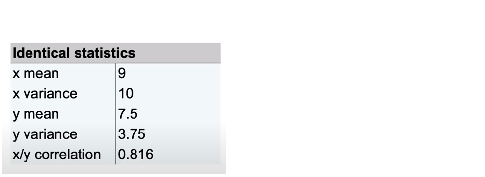
```

---
count: false

## Motivation

- Data visualization is better than numerical summarization alone
```{r, echo = F, out.width = '60%'}
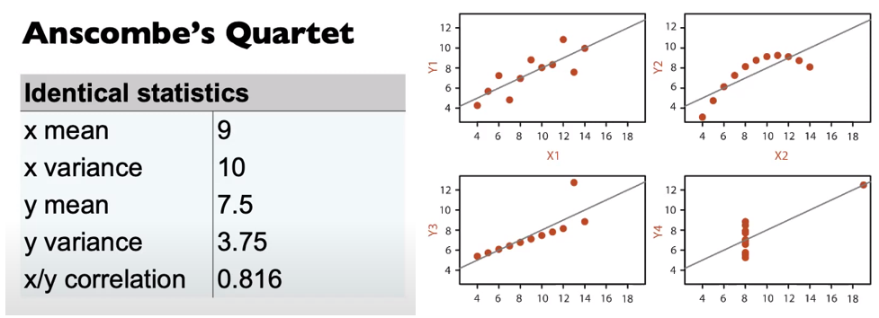
```
*Anscombe, 1973*

<!-- also see: -->
<!-- Datasaurus dozen *Matejka & Fitzmaurice, 2017* \\ -->
<!-- Test is a liability (gorilla data) *Yanai & Lercher, 2020* \\ -->
<!-- Eureka data *Coleman, 1986* \\ -->
--

- Data visualization preprocesses the cognitive work, allowing your audience to better internalize the evidence.
- Important for validating assumption & exploratory data analysis
- Ideally *data*-space rather than *feature*-space
    - *ie. Prefer to visualize X's directly rather than features of X's*
*Wickham, 2015*

---

## Context - Data types

```{r, echo = F, out.width = '70%'}
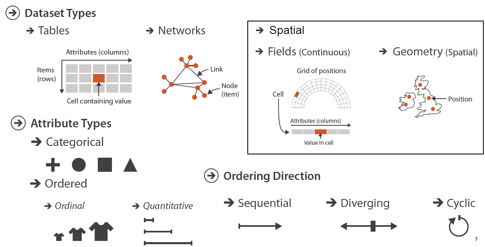
```
*Munzner, 2014*

- Numerical flat tables
- Alternatively, feature-spaces of other formats

---

## Scope - Channel encodings

```{r, echo = F, out.width = '70%'}
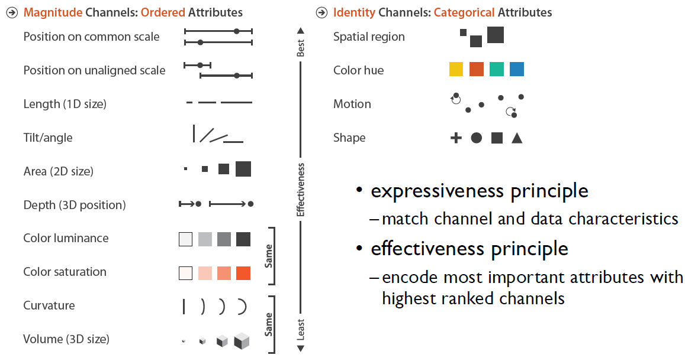
```
*Munzner, 2014*

- Position/spatial comes out on top in either case

---

## The problem

<br>Let data be $X_{n\times p}$, $n$ observations, of $p$ variables
<br><br>**How do we optimally visualize, $p$ dimensions?**
<br><br>
--
<br>1) $p$ univariate histograms/densities curves
--
<br>2) Scatterplot matrices (SPLOM), $p-1$ factorial 2d scatter plots
--
<br>3) Parallel coordinate plot
--
<br>4) Dimension reduction & projects

---

## Example data -- Palmer penguins

- Penguins on 3 islands in Antarctica.
- 330 Observations
- 4 physical measurements, our X's
- 1 categorical classes species, our Y & aesthetic

```{r eval=T, echo=F}
dat <- spinifex::penguins[, 1:6]
knitr::kable(head(dat), format = 'html')
```

---

## Univarite densities & scatterplot matrix.

```{r eval=T, echo=F, out.width='50%'}
X <- dat[, 1:4]
Y1 <- dat$species
GGally::ggpairs(
  X, upper = "blank",
  mapping = ggplot2::aes(color = Y1, shape = Y1)) +
  theme_bw() + 
  scale_color_brewer(palette = "Dark2")
```
`GGally::ggpairs(...)`

- Scalability?
- Features in 3+ variable?

---

## Parallel coordinate plot

```{r eval=T, echo=F, out.width='50%'}
GGally::ggparcoord(
  dat, columns = c(1:4), groupColumn = 5) +
  theme_bw() + 
  scale_color_brewer(palette = "Dark2")
```
`GGally::ggparcoord(...)`

- Asymmetric across variable order
- Scalability?
- Correlation is harder to see

---

## Dimension notation & terminology

$p$ the dimensionality of input space

Let $d$ the dimensionality of output space

__Caveat:__

- Often times our data collection is not efficient in capturing the Intrinsic Data Dimensionality (idd); be careful when $p>idd$
    - A Pyschology survey asking 100 questions about Big Five Personality Traits
    - `DALEX::fifa` 35+ skill measurements, the idd is closer to 8-9

---

## Dimension reduction

**Linear**

- *Affine* transformations: "parrellel lines stay parrellel"
- Examples:
    - Principal Component Analysis (PCA), oriented by variance
    - Linear Discriminant Analysis (LDA), oriented by the separation of the supervised class
    - Visualization _tours_ (next section)

**Nonlinear**

- Other transformations: variable interactions, exponents, _etc._
- Examples:
    - Sammon Plot
    - Self Organizing Maps (SOM)
    - t-distributed Stochastic Neighbor Embedding (tSNE)
    - Uniform Manifold Approximation and Projection (UMAP)

---

## Nonlinear projections

Good news; you are already familiar with (p=3, d=2) non-linear projections!

```{r}
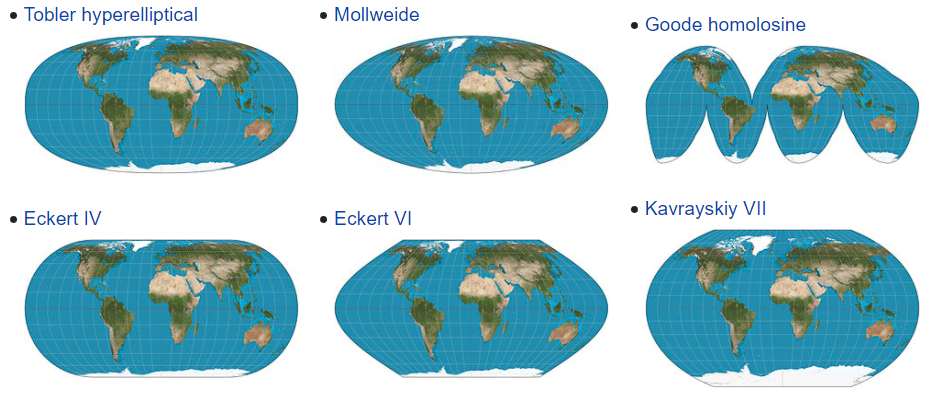
```
*[wikipedia - Map projections](https://en.wikipedia.org/wiki/Map_projection)*

- Inconsistent space: hard to explain & interpret
- Many methods to distort, many hyperparmeters; how faithful is the approximation?
- “All non-linear projections are wrong, but some are useful.”
    - Anatasios Panagiotelis, NUMBAT Seminar, 04/20/2020
    
<!-- (borrowing George Box’s -->
<!-- quote about models) -->

---
class: transition

## Linear projections & data vis _tours_

---


## Linear projections, intuition

You are already familiar with (p=3, d=2) linear projections!

```{r eval=T, echo=F, out.width='100%'}
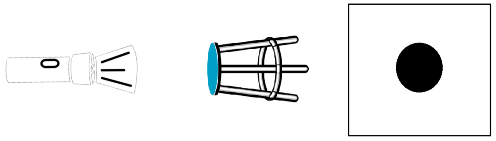
```

---

## Linear projections

```{r eval=T, echo=F, out.width='75%'}
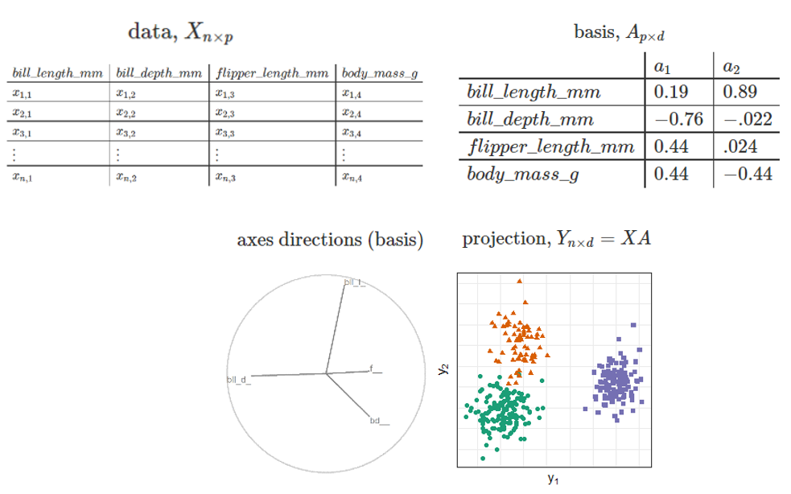
```

Notice how much the species separate when look at them head on with oLDA compared with any frame of SPLOM

--
__Caveat:__

- Often times our output space is of the same dimensionality as our input space
    - PCA returns a $pxp$ matrix, an alternative orientation for the origin
    - The reduction happens when approximate the full space with fewer components, often involving guided, but _subjective_ selection.

---

## Tours

Traditionally, we look at 2 discrete components or combinations of a reduced space....

---

.pull-left[
## Experimental factors

<br><br>
- _factor_; visualization method
- _location_ of separation; mix a signal and noise dimension at different ratios
- _shape_ & orientations of the clusters
- _dimension_-ality and number of clusters
]

.pull-right[
```{r echo = F, out.width = '75%'}
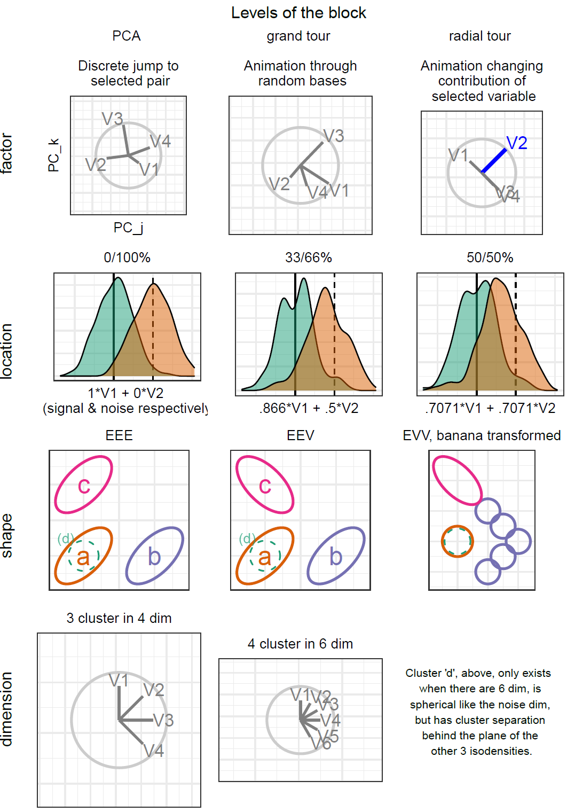
```
]

---

## Task

- Select any/all variables that contribute more than $1/p$ of the separation between the orange triangle and the green circles

```{r echo = F, out.width = '80%'}
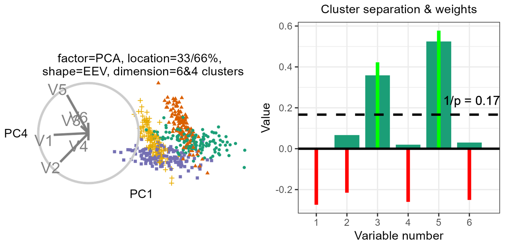
```

---

## Mixed regression model

\begin{array}{ll}
&\widehat{Y} = \mu + \alpha_i * \beta_j + \gamma_k + \delta_l + \textbf{Z} + \textbf{W} + \epsilon \newline
\text{where } &\mu \text{ is the intercept of the model including the means of random effects} \newline
&\alpha_i \text{, fixed term for factor}~|~i\in (\text{pca, grand, radial}) \newline
&\beta_j  \text{, fixed term for location}~|~j\in (\text{0/1, 33/66, 50/50}) \text{ % noise/signal mixing} \newline
&\gamma_k \text{, fixed term for shape}~|~k\in (\text{EEE, EEV, EVV banana}) \text{ model shapes} \newline
&\delta_l \text{, fixed term for dimension}~|~l\in (\text{4 variables & 3 cluster, 6 var & 4 cl}) \newline
&\textbf{Z} \sim \mathcal{N}(0,~\tau), \text{ the random effect of participant} \newline
&\textbf{W} \sim \mathcal{N}(0,~\upsilon), \text{ the random effect of simulation} \newline
&\epsilon   \sim \mathcal{N}(0,~\sigma), \text{ the error of the model} \newline
\end{array}

---

## Results

```{r echo = F, out.width = '90%'}
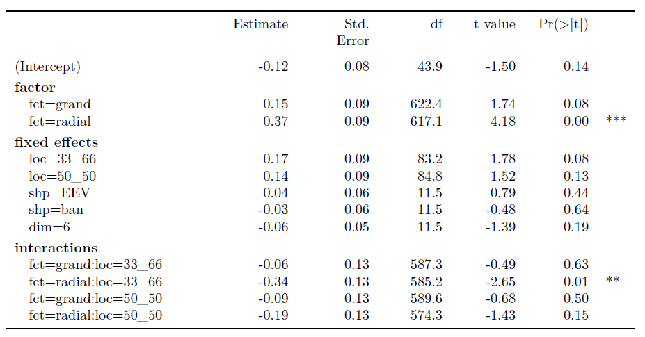
```

---
class: transition

## RO#3, Radial tour and local explanations

---

## Local explanations

- Point-measurement, the variable importance to the model
- Applied to 1 observation, given a model

```{r echo = F, out.width = '60%'}
knitr::include_graphics(
  "./figures/lime_nonlinear.png")
```
*Ribeiro, M. et. al. (2017). Why Should I Trust You?*

---

.pull-left[
## SHAP values

- SHAP is a model-agnostic local explanation, we apply to random forest models
- Approximate variable importance at one point-observation of the model; median importance, permuting over combinations of the explanatory variables
- FIFA 2020 data, model predicting soccer player's wage from the evaluation of their skills
]

.pull-right[
```{r echo = F, out.width = '100%'}
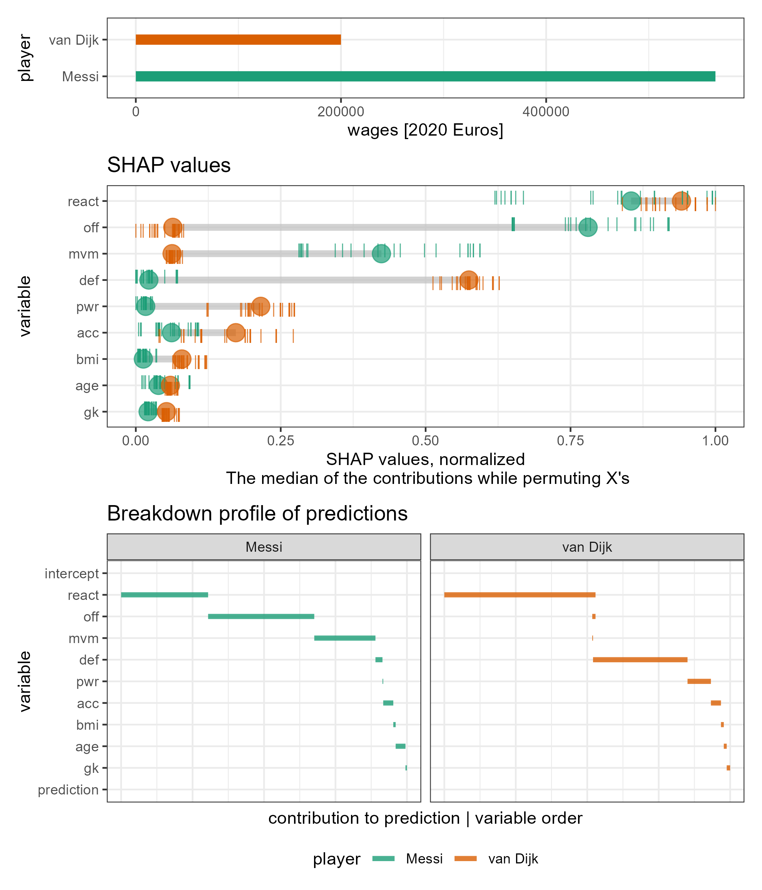
```
]

---
class: transition

## Our application, Trees of Cheem

---

## Global View

```{r echo = F, out.width = '100%', out.height='600px'}
linked_plotly
```

???

- PC1:2 of data (left) and SHAP (right)
- points color and shape are mapped to *predicted* cluster,
- misclassified have red circle.

---

.pull-left[
## Radial tour

- SHAP value of the selected observation, `dashed line`, (previously '*') becomes the 1D projection basis, grey/black bars
- Other SHAP values displayed as faint parallel coordinate lines, comparison observation dotted line (previously 'x')
<br><br>

- Compare initial, full contribution, no contribution
]

.pull-right[
```{r echo = F, out.width='100%', out.height='600px'}
rt_anim
```
]

---

## Conculsion

- local explanation, give observation level variable importance
- Start with a global approximation for exploration and observation selection
- View as a radial tour exploring the structure identified by the SHAP values
    - Default to the variable that has largest deviation from expected value

---

## Thesis progress

- Introduction -- 60%
- Literature review -- 80%
- (RO #1) GI & radial tours -- 90%
- (RO #2) radial tour efficacy user study -- 80%
- (RO #3) radial tour & local explanations -- 70%
- Discussion -- 50%

---

## Thesis timeline

```{r, echo = F, out.width = '85%'}
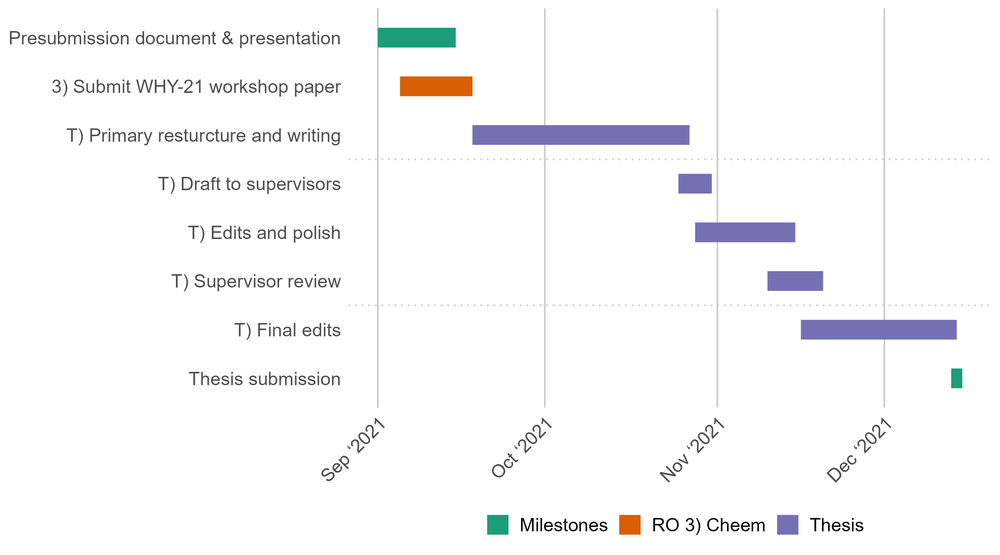
```

---

## Acknowledgments

<br><br>
Special thanks to Professor Przemyslaw Biecek for his time and input suggesting SHAP and FIFA in addition to the `{DALEX}` package eco-system and *Exploratory Model Analysis* book.

<br>
Thanks to Di and Kim for their guidance and the panel and chair for their time and input.

<br>
This research was supported by an Australian government Research Training Program (RTP) scholarship. These slides were in `R` using `{rmarkdown}` and `{xaringan}` *(R Core Team, 2021; Xie et al. 2018; Xie, 2018)*


---
background-size: cover
class: title-slide
count: false

### Thank you for attending, any questions?

<hr><br>

<h1 class="monash-blue" style="font-size: 24pt!important;">`r rmarkdown::metadata$title`</h1>

<br>

<h3 style="font-weight:900!important;">`r rmarkdown::metadata$subtitle`</h2>

.bottom_abs.width100[
<br>
Presenter: *`r rmarkdown::metadata$author`* <br>
`r rmarkdown::metadata$department` <br>
<!-- `r rmarkdown::metadata$email` <br>-->
`r rmarkdown::metadata$date` <br>
<br>
Slides -- [github.com/nspyrison/phd_milestones/_slides](https://github.com/nspyrison/phd_milestones/_slides)
]
