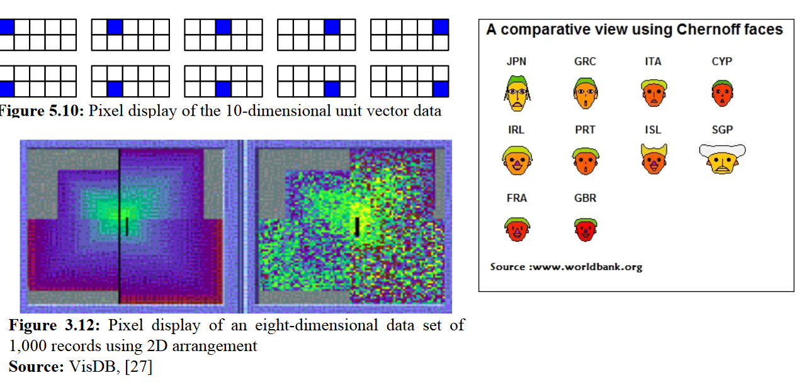
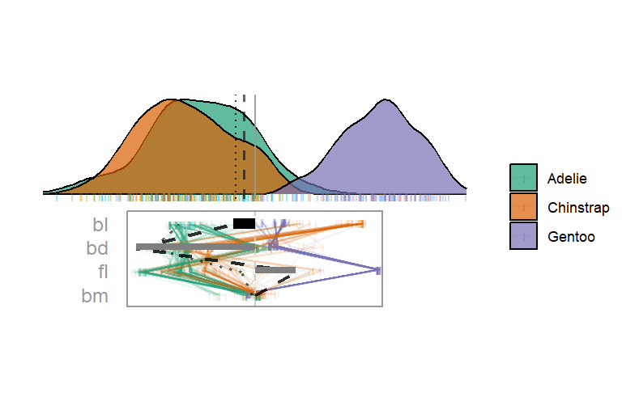

```{r, include=FALSE}
current_file <- knitr::current_input()
basename <- gsub(".Rmd$", "", current_file)

knitr::opts_chunk$set(
  fig.path = sprintf("images/%s/", basename),
  fig.width = 6,
  fig.height = 4,
  fig.align = "center",
  out.width = "100%",
  fig.retina = 3)
```

```{r, setup, include=FALSE}
knitr::opts_chunk$set(
  eval      = TRUE,   # R code
  echo      = FALSE,  # code text
  include   = TRUE,   # plots
  results   = 'asis', # text 'markup' 'asis' 'hold' 'hide'
  fig.align = "center",
  collapse  = TRUE,
  message   = F, warning = F, error = F,
  cache     = F, cache.lazy = F
)
require("knitr")
require("kableExtra")
require("magrittr")
## for cheem stuff:
require("plotly")
require("spinifex")
require("tourr")
require("cheem")

this_ls <- readRDS("./R/preprocess_penguins.rds")
prim_obs <- 296L; comp_obs <- 62L
w <- 1440 *(12/15); h <- 480 * (12/15)
glob_view <- global_view(
  this_ls, prim_obs, comp_obs, height_px = h, width_px = w)

## Prep rt_anim for later -----
if(F){
  bas <- cheem::sug_basis(this_ls$attr_df, prim_obs)
  mv  <- cheem::sug_manip_var(this_ls$attr_df, prim_obs, comp_obs)
  
  ggt142 <- radial_cheem_tour(
    this_ls, bas, mv,
    prim_obs, comp_obs,
    pcp_shape = 124,
    ## '|' == 142 & 124 got plotly and gganimate respectively
    angle = .08)
  anim <- animate_gganimate(
    ggt142, fps = 4, rewind = TRUE,
    start_pause = 1, end_pause = 2,
    height = w * (4/9), width = w * (2/3), units = "px",
    res = 150)
  ## Save rendered animation as .gif
  gganimate::anim_save("cheem_tour.gif",
                       animation = anim,
                       path = "./figures")
}
# rt_anim <- animate_plotly(
#   ggt142, fps = 4L, width =, height = w * (4/9)) %>%
#   layout(dragmode = FALSE, showlegend = FALSE,
#          xaxis = list(scaleratio = 3L))
# ## extra wide cause densities are narrow
```

background-size: cover
class: title-slide
count: false

# .monash-blue[`r rmarkdown::metadata$title`]
<br>
<h2 style="font-weight:900!important;">`r rmarkdown::metadata$subtitle`</h2>
.bottom_abs.width100[
<br>
*`r rmarkdown::metadata$author`* <br>
`r rmarkdown::metadata$email` <br>
`r rmarkdown::metadata$affiliation` <br>
`r rmarkdown::metadata$date` <br><br>
Slides -- `r rmarkdown::metadata$slides_url`
]
---

# Terminology & bias

- Stats background, your preferred terms may vary
- __Variable__ - _p_, attribute, measure, column
- __Observation__ - _n_, item, instance, sample, repetition, row
- __Projection__ - an embedded space, of _d < p_ dimension
- __Dimension__ - Overloaded, but __p__ data or approximated space, __d__ projection
- R, Grammar of Graphics, & __ggplot2__

<br>
# Etiquette

- Please interrupt for clarifications & elaboration
- Tangential or extension questions at the end, time permitting

---

# Contents

- Context and data
- Traditional techniques
- Dimension reduction
- Tours
- Cheem

---

# Context: data types

```{r out.width = '70%'}
knitr::include_graphics("./figures/munzner_datatypes.PNG")
```
*Munzner, 2014*

- Complete numerical matrix
- Alternatively, feature decomposition of other formats

---

# Example data -- Palmer penguins

- Penguins near Palmer Station, Antarctica
- 330 observations
- X variables: 4 physical measurements
- Species of penguin mapped to color & shape

```{r}
dat <- spinifex::penguins_na.rm[, 1:5]
knitr::kable(head(dat), format = 'html')
```

---

# Scatterplot matrix (SPLOM, small multiples)

```{r out.width='50%'}
X <- dat[, 1:4]
Y <- dat$species
GGally::ggpairs(X, lower = "blank",
                upper = list(continuous = "points", combo = "facethist",
                             discrete = "facetbar", na = "na"),
                mapping = ggplot2::aes(color = Y, shape = Y)) +
  theme_bw() +
  scale_color_brewer(palette = "Dark2") +
  scale_fill_brewer(palette = "Dark2") +
  theme(axis.text = element_blank(), axis.ticks = element_blank())
```
_Chambers, 1983_

```
GGally::ggpairs(...)
```

- Scalability?
- Structure in 3+ variables?

---

# Parallel coordinate plot

```{r, out.width='50%'}
GGally::ggparcoord(
  dat, columns = c(1:4), groupColumn = 5) +
  theme_bw() +
  scale_color_brewer(palette = "Dark2") +
  labs(x="", y="") +
  theme(legend.position = "bottom", legend.direction = "horizontal", 
        axis.text.y = element_blank(), axis.ticks.y = element_blank())
```
_Ocagne, 1885_
```
GGally::ggparcoord(...)
```

- Scalability?
- Poor comparison across non-adjacent variables; asymmetric across variable order
- Correlation is harder to extract

---

# Bonus: observation-based (observation-mapped axes)

```{r out.width='80%'}

```

- Scalability? Interpretability? Correlation?
- Asymmetric across variable order

---

# Bonus: Chernoff faces

- Scalability? Interpretability? Correlation?

```
tourr::animate_faces() ## Only for fun?
```

```{r out.width = '50%'}
x <- dat[c(1:10, 266:275), 1:4] |> scale_sd()
bas <- tourr::save_history(x, max_bases = 1)
tourr::animate_faces(x, grand_tour(3))
```

---

# Dimension reduction

**Linear**

- *Affine* transformations: "parrellel lines stay parrellel"
- Examples:
    - Principal Component Analysis (PCA), oriented by variance
    - Linear Discriminant Analysis (LDA), oriented by the separation of the supervised class
    - Visualization _tours_ (next section)

--

**Nonlinear**

- Other transformations: variable interactions, exponents, _etc._
- Examples:
    - Sammon mapping
    - Self Organizing Maps (SOM)
    - t-distributed Stochastic Neighbor Embedding (tSNE)
    - Uniform Manifold Approximation and Projection (UMAP)

---

# Nonlinear projections

Good news; you are already familiar with $(p=3, d=2)$ non-linear projections!

```{r, out.width='60%'}
knitr::include_graphics("./figures/intuition_nonlinear_proj.PNG")
```
[wikipedia - Map projections](https://en.wikipedia.org/wiki/Map_projection)

- Inconsistent space; hard to explain & interpret
- Many methods, many hyperparmeters; how _faithful_ is the representation?

“All non-linear projections are wrong, but some are useful.”
<br>--- Anatasios Panagiotelis (play on George Box’s quote about models)
<!-- quote from: NUMBAT Seminar, 04/20/2020 -->

---
class: transition

## Linear projections & _tours_

---

# Linear projections -- intuition

Good news; you are already familiar with ($p=3, d=2$) linear projections!

```{r, out.width='100%'}
knitr::include_graphics("./figures/intuition_linear_proj.PNG")
```

- Not all orientations hold interesting structure
- But structural information could be gleaned from rotation

---

# Linear projections  -- rotation

<br>
```{r, out.width='100%'}
knitr::include_graphics(
  "./figures/linear_proj_wide.png")
```
LDA: _Fischer, 1936_, supervised cluster separation

Given the distributions and orientations of different clusters, find a basis (rotation) that separate clusters the most

--

- Often times our output space is of the same dimensionality as our input space
    - eg. PCA returns a $pxp$ basis
    - The reduction happens when the space is approximated with fewer components, often involving guided, but _subjective_ selection. eg. Finding an "elbow" in screeplot
    - Or worse -- only showing PC1:2, with no recognition or discussion of the others

---

# Linear projections -- traditional process

<br><br>
1) Scale each variable to [0, 1] or by standard deviations away from the mean (z-score)<br>
2) Some people 'whiten' or 'sphere' transform the covariance matrix to an identity matrix; should be justified<br>
3) If $p$ is sizable, say more than 10 or, may first approximate the data in fewer components to get to a realistic dimensionality to view
- Typically with PCA by eyeballing an elbow in the screeplot
- "We approximate 90% of the variation of our 20 variable in the first 5 principal components"
- Alternative mathematical approximations: "intrinsic dimensionality estimation"

4) Visualize data- or component- space

--
<br><br>
Visualize _one rotation (or more if lucky);_ **static, not interactive**

---

# Tours

- Instead of viewing only static views, *animate* small changes in the basis over time
    - Object permanence between frames; can see observations and cluster moving together

```{r, out.width='50%'}
knitr::include_graphics(
  "./figures/tour_frames.PNG")
```
*Buja et al., 2005*

---

# Grand tour
*Asimov, 1984*

.left-two-thirds[
```{r, out.width='100%'}
if(F){
  dat <- spinifex::penguins_na.rm[, 1:5]
  X <- dat[, 1:4]
  Y <- dat$species
  X_std <- X %>% spinifex::scale_sd()
  
  gt_path <- spinifex::save_history(X_std, max_bases = 12)
  
  ggt <- ggtour(gt_path, angle = .1) +
    proto_point(aes_args = list(color = Y, shape = Y),
                identity_args = list(size = 1.5)) +
    proto_basis(text_size = 6) +
    proto_origin()
  
  anim <- animate_gganimate(
    ggt, 
    width = w * (2/3), height = w * (4/9), 
    res = 150, unit = "px", fps = 6)
  gganimate::anim_save("grand_tour.gif",
                       animation = anim,
                       path = "./figures")
}
include_graphics("./figures/grand_tour.gif")
```
]

.right-third[
```
library(spinifex)
grand_tour() %>%
  ggtour() +
  proto_point() +
  proto_basis() +
  proto_origin() %>%
  animate_gganimate()
```
]

---

# Tour taxonomy

Distinguished by how the basis path is produced
<br>

```{r}
kableExtra::kbl(data.frame(
  `Tour type` =
    c("grand", "guided", "manual", "local", "_et al._"),
  `Target bases` =
    c("random bases", "objective function (simulated annealing)",
      "change the contribution of selected variable",
      "random bases within a local vacinity", "slicing, lensing"),
  check.names = FALSE))
```

--

<br>
- The grand tour is good for EDA, but selects target frames randomly, no objective function
- Hypothesis; Bill length is important for distinguishing the orange cluster
- Issue; Component spaces and grand tour have no user interaction to "steer" the basis
- Response; Control its contribution with a _manual tour_

---

# Manual tour
*Cook & Buja, 1997. Spyrison & Cook, 2020*

.left-two-thirds[
```{r, out.width='100%'}
if(F){
  mt_path <- basis_pca(X_std) %>%
    spinifex::manual_tour(manip_var = 1, ## "bill_length_mm"
                          data = X_std)
  ggt <- ggtour(mt_path, angle = .2) +
    proto_default(aes_args = list(color = Y, shape = Y),
                  identity_args = list(size = 2))
  
  anim <- animate_gganimate(ggt, width = w * (2/3), height = w * (4/9), 
                            res = 150, unit = "px")
  gganimate::anim_save("manual_tour.gif",
                       animation = anim,
                       path = "./figures")
}
include_graphics("./figures/manual_tour.gif")
```
]

.right-third[
```
manual_tour() %>%
  ggtour() +
  proto_point() +
  proto_basis() +
  proto_origin() %>%
  animate_gganimate()
```
]

---

# Tours in R

```{r, results='markup'}
kableExtra::kbl(data.frame(
  Package = c("{tourr}", "_{spinifex}_", "{ferrn}",
              "{liminal}", "{loon.tour}", "_{cheem}_", 
              "{detour}"),
  Description = c("Tour paths, geodesic interpolation, display in *interactive* base R", "Manual tours, compose animations exportable to plotly/gganimate", "Diagnostic plots for projection pursuit (guided tour), tracing basis-paths", "Ensemble graphics with tSNE and tours side-by-side", "Graphics display system 'loon' for tours", "Explore local explanations of non-linear models with the radial tour", "Alternative HTML with brushing and 3D proj, but no basis"),
  Authors = c("Wickham et al., 2011", "Spyrison & Cook, 2020", "Zhang et al., 2021", "Lee, 2021", "Xu & Oldford, 2021", "Spyrison, 2022", "Hart & Wang, 2022")
))
```

--

- Reminder: other geometric display can be used when $d!=2$
    - 1D density curves
    - 3D scatterplot
    - $d$-dim scatterplot matrix, parallel coordinate plots

---

# Overview tours

Also see: [A review of State-of-the-Art on Tours, arxiv.org/pdf/2104.08016.pdf](https://arxiv.org/pdf/2104.08016.pdf), preprint of accept WIREs article

- User interaction
- Basis paths, as inscribed on $p-$spheres/torii
- Slicing to explore hollowness and structure
- Scalar Vector Machine boundaries
- Guided tours on classification Random Forests
- Visualizing neural networks

---
class: transition

## Local explanation of a black-box models & application of radial tours, _cheem_

---

# Local explanation

- Given a non-linear ("blackbox") model, how can we maintain interpretability
- Approximation of the linear variable importance to the model in the vicinity of _one_ observation of a model

```{r, echo = F, out.width = '60%'}
knitr::include_graphics(
  "./figures/lime_nonlinear.png")
```
_Ribeiro, et al. (2017). Why Should I Trust You?_

---

.pull-left[
# SHAP values

- SHapley Additive exPlanation
- FIFA 2020 data, 5000 observations, ~35 skill measurements aggregated to 9 variables, Y: wages [2020 Euros]
- Model: Random forest regressing wages from 9 skill measurements
- SHAP is a model-agnostic local explanation
- Approximate linear variable importance at one observation; the median importance, permuting over combinations of the explanatory variables

**The model has very different variable importance across the player position**
]

--

.pull-right[
```{r, echo = F, out.width = '100%'}
knitr::include_graphics(
  "./figures/cheem_fifa_messi_dijk.png")
```
]

---

# Cheem, concept

- Create a non-linear model
- Extract explanations for every observation (computationally expensive)
- __Global view__: approximate data- and attribution-space side-by-side
    - Explore with liked brushing, tooltips, interactive tabular display
    - Select a primary and comparison point to explore their explanation
- __Cheem radial tour__:
    - Primary point attribution of the becomes the initial basis
    - Evaluate/explore the explanation by testing the support of variable contributions

--
<br>
__New__, at a github server near you,

- model- and local explanation-agnostic (BYO)
- Illustrationed with random forests and a tree SHAP (reduced computational complexity)

---

# Global View

```{r, echo = F, out.width = '100%'}
glob_view
```

- Select a primary and comparison point, typically misclassified and neighboring correctly classified
- Use the SHAP values of the primary point as the basis, perform a 1D radial (manual) tour to interrogate the models explanation

???

- PC1:2 of data (left) and SHAP (right)
- Points color and shape are mapped to *predicted* cluster
- Misclassified have red circle

---

.left-third[
# Cheem radial tour

- Primary & comparison observation: dashed & dotted lines
- SHAP values displayed as parallel coordinate lines on basis
<br><br>

- **The misclassified point downplays the weight on V2; this discrepancy is a measure of how differently this misclassified point is, compared with its peers**
]

.right-two-thirds[
```{r, echo = F, out.width='100%', out.height='600px'}

```
]

---

# Demo the app

Explore interactively with an R shiny application

<br>
Local resources:
```{r, echo=T,eval=F}
cheem::run_app()
```
<br>

- Externally hosted shiny app (outdated): [ebsmonash.shinyapps.io/cheem_initial/](https://ebsmonash.shinyapps.io/cheem_initial/)
- __cheem__ (back) on CRAN soon, available on GitHub: [github.com/nspyrison/cheem](https://github.com/nspyrison/cheem)

---

# Cheem -- getting started

<br><br>
```
## Install cheem development version & its CRAN dependancies.
remotes::install_github("nspyrison/cheem", dependencies = TRUE)
## Run the {cheem} app
cheem::run_app()
## BYO data, model, local explanation:
?cheem::cheem_ls
```

---

# Namesake

- __Cheem__ are a fictional race of bipedal trees from the Dr. Who universe
- (Original implementation) on tree based models, __DALEX__ ecosystem

```{r out.width='60%'}
knitr::include_graphics(
  "./figures/cheem.jpg")
```

---

# Acknowledgments

<br><br>
Thanks to Professor Przemyslaw Biecek for his guidance and input, in addition to the __DALEX__ package ecosystem and _Exploratory Model Analysis_ book

<br>
Thanks to Di Cook and Kim Marriott for their supervision

<br>
This research was supported by an Australian government Research Training Program (RTP) scholarship. These slides created in __R__ using __rmarkdown__ and __xaringan__ *(R Core Team, 2021; Xie et al. 2018; Xie, 2018)*

<br>
_Tentatively,_ IFF may support continued development of related content; broader preprocessing functions, more/better geom-like displays

---
background-size: cover
class: title-slide
count: false

# Thank you for attending
<hr><br>
<h2 class="monash-blue" style="font-size: 20pt!important;">`r rmarkdown::metadata$title`</h1>
<br>
<h3 style="font-weight:900!important;">`r rmarkdown::metadata$subtitle`</h2>
.bottom_abs.width100[
<br>
*`r rmarkdown::metadata$author`* <br>
`r rmarkdown::metadata$email` <br>
`r rmarkdown::metadata$affiliation` <br>
`r rmarkdown::metadata$date` <br><br>
Slides -- `r rmarkdown::metadata$slides_url`
]
